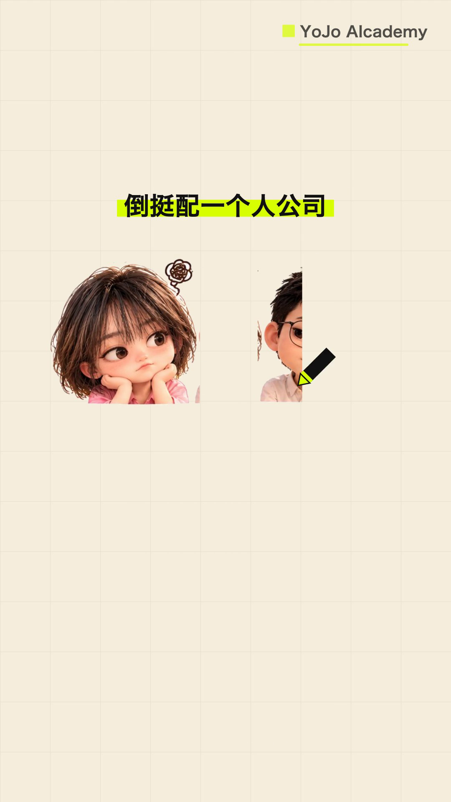
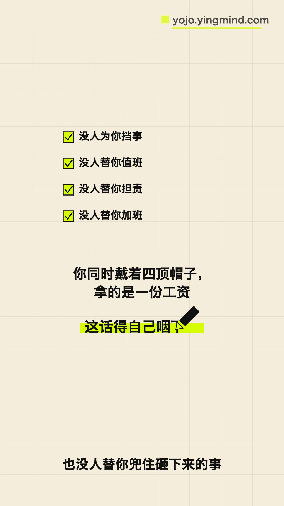
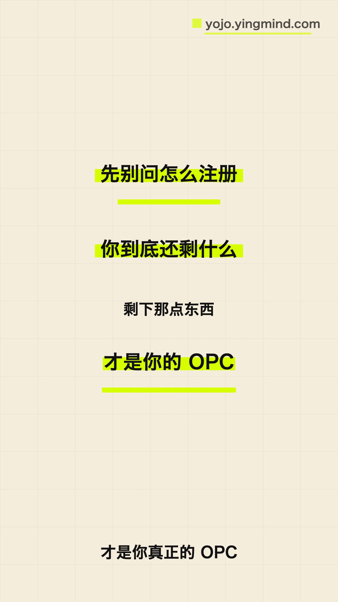
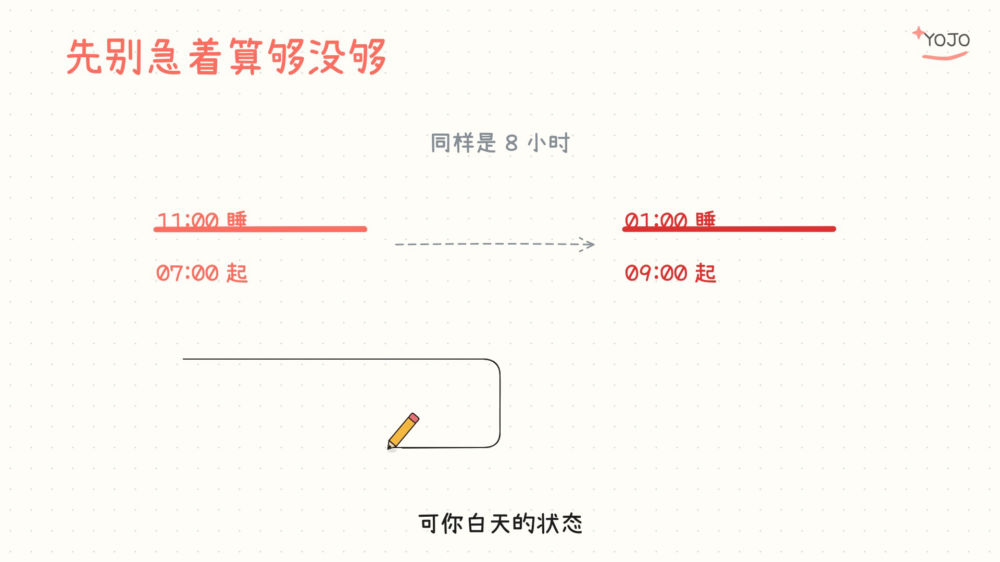
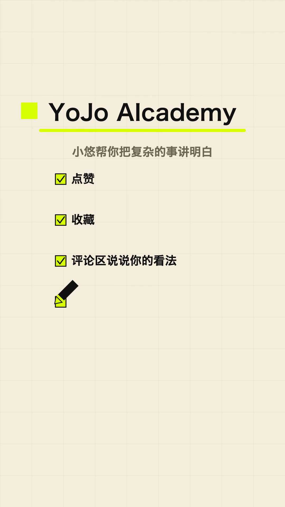

# 白板视频 Pro · 试用说明

手绘白板风「边画边讲」讲解视频工作台。**写文案就能出片，不用剪辑软件。**

旁白配音 → 逐笔手绘动画 → 烧录字幕 → 成片，全部本地跑完。横版 16:9、竖版 9:16 都支持。

---

## 出片长什么样

下面全部是实拍样稿，从真实成片里抽的帧，不是宣传图。

**竖版 9:16 · 划重点与 Q 版角色**



**竖版 9:16 · 清单版式**



**竖版 9:16 · 金句排版**



**横版 16:9 · 对比图示**



**竖版 9:16 · 节日问候**


---

## 怎么试用

```bash
npm install                   # 装依赖，约 2 分钟
./安装.sh                      # 一次性设置：项目目录 / 画幅 / 配音
./bin/wb new "第一期标题"      # 建期，写文案
./bin/wb stills "第一期标题"   # 出静帧，逐张看排版
./bin/wb shoot "第一期标题"    # 配音 → 渲染 → 混音 → 封面
```

成片在 `build/<日期 标题>/outputs/final.mp4`，封面和字幕在期目录里。

配音走豆包 TTS，开通与音色克隆的步骤见 [`01-安装与豆包语音设置.md`](01-安装与豆包语音设置.md)。

---

## 试用版能做什么

编辑 `我的设置.json` 一处，其余一概不用碰：

| 类别 | 具体 |
|---|---|
| 水印与片尾卡 | 开关、文字、位置、大小、透明度、Logo、slogan、联系方式、时长 |
| 内容 | 每期 `scenes.js` 文案、贴纸素材 |
| 声音 | 音色 ID、语速、语气、音高、角色表、换人换气口 |
| 字幕 | 字号、位置、最大字数、竖版专属参数 |
| 画面与声音 | 画幅 9:16 / 16:9、配乐文件与音量、封面画幅与系列标签 |

**成片默认是干净的**：不打水印、不加片尾卡，出片里没有本产品的任何字样。
想打自己的品牌，往 `我的设置.json` 里填什么打什么。

**唯一不可改的是风格**（配色、字体、书写节奏）。边界与原因见 [`02-可改项与不可改项.md`](02-可改项与不可改项.md)。

---

## 试用前知道这几件事

- **依赖要自己装**：包里不带 `node_modules`，`npm install` 一次即可
- **配乐不自带**：放一首无版权音乐到 `assets/bgm.mp3`，没有就出无配乐成片
- **语音要钱**：豆包 TTS 按量计费，新账号有免费额度
- **贴纸生成**：靠本地 codex CLI 出图；装不了就用期目录 `assets/` 里的贴纸，或用 `./bin/wb keyout 期 图片路径` 把自己的图抠成透明底贴纸
- **风格不可自定义**：这是授权范围，放开要走定制

---

## 从试用到正式

试用满意后拿正式版，会拿到：

- 完整的守卫与版本更新通道（改版本号一键出新包，设置直接沿用）
- 自定义风格的升级路径（见 [`03-自定义风格与升级通道.md`](03-自定义风格与升级通道.md)）
- 更多 AI 定制、批量生产、团队多人版

---

## 样稿里的品牌

上面样稿右上角和片尾卡里出现的 **YoJo Alcademy**，是我们自己的品牌账号，这些帧就是用本工具为我们自己账号做的内容。



这套工具给谁用，成片上打的就是谁的品牌——你拿去用，片子里出现的应该是你的名字，不是我们的。

小悠帮你把复杂的事讲明白。需要更多 AI 定制工具与专属定制 → **yojo.yingmind.com**
